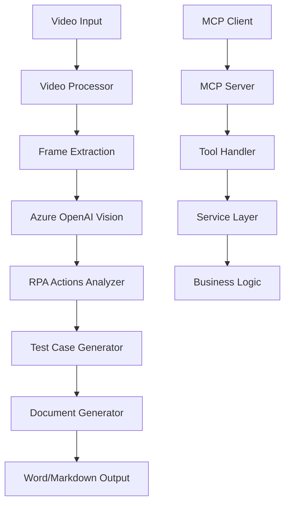

# 🤖 RPA Analysis MCP Server

> **Server MCP per l'analisi funzionale di processi RPA da video utilizzando Azure OpenAI**

Un server Model Context Protocol (MCP) avanzato che analizza video di processi aziendali e genera automaticamente documenti di analisi funzionale per implementazioni RPA con Microsoft Power Automate Desktop.

[](https://opensource.org/licenses/MIT)
[](https://nodejs.org/)
[](https://www.typescriptlang.org/)

---

## 🚀 Funzionalità Principali

### 🎥 **Processamento Video Intelligente**
- Estrazione automatica frame chiave da video
- Supporto formati: MP4, AVI, MOV, WMV, MKV, WebM
- Ottimizzazione qualità frame per analisi AI

### 🤖 **Analisi AI Avanzata**
- Integrazione Azure OpenAI GPT-4 Vision
- Identificazione automatica azioni RPA
- Mappatura su Power Automate Desktop actions
- Generazione test case completi

### 📄 **Generazione Documenti Professionali**
- Template Word (.docx) e Markdown (.md)
- Struttura documenti di analisi funzionale standard
- Contenuti personalizzabili per diversi livelli di dettaglio

### ☁️ **Deploy Cloud Ready**
- Containerizzazione Docker completa
- Template Azure Bicep per infrastruttura
- Azure Container Instances ready
- Scalabilità automatica

---

## 📋 Requisiti di Sistema

### 🖥️ **Ambiente di Sviluppo**
- **Node.js**: >= 18.0.0
- **NPM**: >= 9.0.0
- **TypeScript**: >= 5.3.0
- **FFmpeg**: Ultima versione stabile

### ☁️ **Servizi Cloud**
- **Azure OpenAI**: Subscription attiva
- **GPT-4 Vision**: Modello deployato
- **Azure Storage**: (Opzionale) Per file temporanei

### 🐳 **Container (Opzionale)**
- **Docker**: >= 20.0.0
- **Docker Compose**: >= 2.0.0

---

## ⚡ Quick Start

### 1️⃣ **Installazione Rapida**

```bash
# Clona il repository
git clone https://github.com/your-username/rpa-analysis-mcp-server.git
cd rpa-analysis-mcp-server

# Installa dipendenze
npm install

# Configura ambiente
cp .env.example .env
# Modifica .env con le tue credenziali Azure OpenAI

# Build e avvio
npm run build
npm start
```

### 2️⃣ **Configurazione Azure OpenAI**

```env
AZURE_OPENAI_ENDPOINT=https://your-resource.openai.azure.com/
AZURE_OPENAI_API_KEY=your-api-key-here
AZURE_OPENAI_DEPLOYMENT_NAME=gpt-4-vision
```

### 3️⃣ **Test di Funzionamento**

```bash
# Test rapido con video di esempio
npm run test

# Avvio in modalità sviluppo
npm run dev
```

---

## 🛠️ Configurazione Dettagliata

### 🔧 **Variabili d'Ambiente**

| Variabile | Descrizione | Default | Richiesta |
|-----------|-------------|---------|-----------|
| `AZURE_OPENAI_ENDPOINT` | Endpoint Azure OpenAI | - | ✅ |
| `AZURE_OPENAI_API_KEY` | API Key Azure OpenAI | - | ✅ |
| `AZURE_OPENAI_DEPLOYMENT_NAME` | Nome deployment GPT-4 Vision | `gpt-4-vision` | ✅ |
| `LOG_LEVEL` | Livello di logging | `info` | ❌ |
| `MAX_VIDEO_SIZE_MB` | Dimensione massima video | `500` | ❌ |
| `MAX_FRAME_EXTRACTION` | Frame massimi estraibili | `50` | ❌ |
| `DEFAULT_FRAME_INTERVAL` | Intervallo frame (secondi) | `5` | ❌ |

### 🎬 **Configurazione FFmpeg**

#### Windows
```bash
# Chocolatey
choco install ffmpeg

# Scoop
scoop install ffmpeg
```

#### macOS
```bash
# Homebrew
brew install ffmpeg
```

#### Linux
```bash
# Ubuntu/Debian
sudo apt update && sudo apt install ffmpeg

# CentOS/RHEL
sudo yum install ffmpeg
```

---

## 🎯 Utilizzo

### 💻 **Con Claude Desktop**

Aggiungi la configurazione al file `claude_desktop_config.json`:

```json
{
  "mcpServers": {
    "rpa-analysis": {
      "command": "node",
      "args": ["path/to/rpa-analysis-mcp-server/dist/server.js"],
      "env": {
        "AZURE_OPENAI_ENDPOINT": "https://your-resource.openai.azure.com/",
        "AZURE_OPENAI_API_KEY": "your-api-key"
      }
    }
  }
}
```

### 🔧 **Tool Disponibili**

#### 1. `analyze_video_for_rpa`
Analizza un video completo per estrarre azioni RPA e test case.

```typescript
{
  "videoPath": "/path/to/process-video.mp4",
  "processName": "Processo di Login Utente",
  "outputFormat": "docx", // o "md"
  "frameInterval": 5,     // secondi tra frame
  "templateType": "standard" // "standard", "detailed", "minimal"
}
```

#### 2. `generate_rpa_document`
Genera documento da dati strutturati esistenti.

```typescript
{
  "processData": {
    "processName": "Processo Acquisto",
    "summary": "Processo automatizzato di acquisto online",
    "rpaActions": [...],
    "testCases": [...]
  },
  "outputFormat": "docx",
  "author": "Team RPA"
}
```

#### 3. `extract_video_frames`
Estrae solo i frame da un video per analisi manuale.

```typescript
{
  "videoPath": "/path/to/video.mp4",
  "intervalSeconds": 3,
  "maxFrames": 30
}
```

---

## 🏗️ Architettura del Sistema



### 📁 **Struttura del Progetto**

```
rpa-analysis-mcp-server/
├── 📁 src/
│   ├── 🚀 server.ts                 # Server MCP principale
│   ├── 📁 services/                 # Business Logic
│   │   ├── 🎬 video-processor.ts    # Processamento video
│   │   ├── 🤖 azure-openai.ts       # Integrazione AI
│   │   ├── 📄 document-generator.ts # Generazione documenti
│   │   └── 📋 template-manager.ts   # Gestione template
│   ├── 📁 models/                   # Modelli dati
│   ├── 📁 utils/                    # Utility comuni
│   └── 📁 templates/                # Template documenti
├── 📁 deployment/                   # File deployment
│   ├── 🐳 Dockerfile               # Container definition
│   ├── ☁️ docker-compose.yml       # Multi-container setup
│   └── 📁 bicep/                   # Azure Infrastructure
├── 📁 scripts/                     # Script automazione
└── 📁 tests/                       # Test suite
```

---

## 🚀 Deploy su Azure

### 🔧 **Deploy Automatico**

```bash
# Configura Azure CLI
az login

# Deploy completo
./scripts/deploy.sh all
```

### 🏗️ **Deploy Manuale**

#### 1. Crea Resource Group
```bash
az group create \
  --name rpa-analysis-rg \
  --location "West Europe"
```

#### 2. Deploy Infrastruttura
```bash
az deployment group create \
  --resource-group rpa-analysis-rg \
  --template-file deployment/bicep/main.bicep \
  --parameters \
    appName=rpa-analysis \
    openAIEndpoint="https://your-resource.openai.azure.com/" \
    openAIApiKey="your-api-key"
```

#### 3. Build e Push Container
```bash
# Build locale
docker build -t rpa-analysis-mcp .

# Tag per Azure Container Registry
docker tag rpa-analysis-mcp your-acr.azurecr.io/rpa-analysis-mcp:latest

# Push
az acr login --name your-acr
docker push your-acr.azurecr.io/rpa-analysis-mcp:latest
```

### 📊 **Monitoraggio**

Azure Application Insights è configurato automaticamente per:
- 📈 Metriche di performance
- 🐛 Error tracking
- 📊 Usage analytics
- 🔍 Distributed tracing

---

## 🧪 Testing

### 🔬 **Test Suite Completa**

```bash
# Test unitari
npm test

# Test integrazione
npm run test:integration

# Test end-to-end
npm run test:e2e

# Coverage report
npm run test:coverage
```

### 📊 **Test Performance**

```bash
# Benchmark video processing
npm run benchmark:video

# Load testing
npm run test:load
```

---

## 