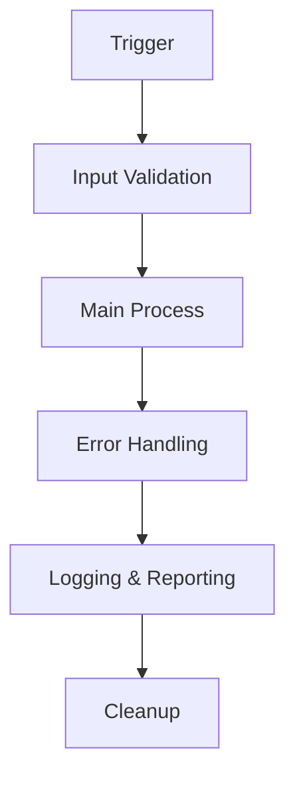

# 📋 Documento di Analisi Funzionale RPA - {{PROCESS_NAME}}

> **Generato automaticamente** dal Sistema di Analisi RPA  
> **Data**: {{CREATION_DATE}}  
> **Versione**: {{VERSION}}

---

## 📊 Informazioni Generali

| 🏷️ Campo | 📝 Valore |
|-----------|-----------|
| **Nome del Processo** | {{PROCESS_NAME}} |
| **Data di Creazione** | {{CREATION_DATE}} |
| **Versione Documento** | {{VERSION}} |
| **Autore** | {{AUTHOR}} |
| **Azioni RPA Identificate** | {{RPA_ACTIONS_COUNT}} |
| **Test Case Generati** | {{TEST_CASES_COUNT}} |
| **Livello di Complessità** | {{COMPLEXITY_LEVEL}} |

---

## 🎯 Sommario Esecutivo

### Obiettivo del Progetto
Questo documento presenta l'analisi funzionale completa del processo "**{{PROCESS_NAME}}**" per l'implementazione di un'automazione RPA utilizzando **Microsoft Power Automate Desktop**.

### Risultati dell'Analisi
{{EXECUTIVE_SUMMARY}}

### 📈 Benefici Attesi
- ⚡ **Efficienza**: Riduzione del tempo di esecuzione del processo
- 🎯 **Qualità**: Eliminazione degli errori manuali  
- 📊 **Tracciabilità**: Miglioramento del monitoraggio delle operazioni
- 👥 **Risorse**: Liberazione di personale per attività a maggior valore

### 📋 Metriche di Progetto
| Metrica | Valore |
|---------|--------|
| Tempo di Sviluppo Stimato | {{ESTIMATED_DEVELOPMENT_TIME}} |
| Livello di Rischio | {{RISK_LEVEL}} |
| ROI Previsto | {{EXPECTED_ROI}} |

---

## 🤖 Azioni RPA Identificate

### 📝 Panoramica
Sono state identificate **{{RPA_ACTIONS_COUNT}}** azioni automatizzabili nel processo analizzato. Ogni azione è stata mappata sui corrispondenti comandi di Power Automate Desktop.

{{#EACH RPA_ACTIONS}}
### 🔧 Azione {{STEP}}: {{DESCRIPTION}}

```yaml
ID: {{ID}}
Tipo: {{ACTION_TYPE}}
Categoria: {{CATEGORY}}
Complessità: {{COMPLEXITY}}
```

#### 🎯 Target e Parametri
{{#IF TARGET}}
**Target**: `{{TARGET}}`
{{/IF}}

{{#IF PARAMETERS}}
**Parametri**:
```json
{{PARAMETERS}}
```
{{/IF}}

#### ✅ Prerequisiti
{{#EACH PREREQUISITES}}
- {{.}}
{{/EACH}}

#### ⚠️ Gestione Errori
{{#IF ERROR_HANDLING}}
- **Strategia**: {{ERROR_HANDLING.STRATEGY}}
- **Tentativi**: {{ERROR_HANDLING.MAX_RETRIES}}
- **Timeout**: {{ERROR_HANDLING.TIMEOUT_MS}}ms
{{/IF}}

#### 🔍 Validazione
{{#IF VALIDATION}}
- **Metodo**: {{VALIDATION.VALIDATION_METHOD}}
- **Criterio**: {{VALIDATION.EXPECTED_RESULT}}
{{/IF}}

---
{{/EACH}}

## 🧪 Test Cases

### 📊 Distribuzione Test Cases
| Tipo | Quantità | Percentuale |
|------|----------|-------------|
| ✅ Positivi | {{POSITIVE_TESTS_COUNT}} | {{POSITIVE_TESTS_PERCENTAGE}}% |
| ❌ Negativi | {{NEGATIVE_TESTS_COUNT}} | {{NEGATIVE_TESTS_PERCENTAGE}}% |
| ⚠️ Edge Case | {{EDGE_TESTS_COUNT}} | {{EDGE_TESTS_PERCENTAGE}}% |

{{#EACH TEST_CASES_BY_TYPE}}
### {{TYPE_EMOJI}} {{TYPE_TITLE}}

{{#EACH CASES}}
#### 🧪 {{TITLE}}

```yaml
ID: {{ID}}
Tipo: {{TYPE}}
Priorità: {{PRIORITY}}
Durata Stimata: {{ESTIMATED_DURATION}}
```

**📝 Descrizione**: {{DESCRIPTION}}

{{#IF PRECONDITIONS}}
**🔧 Precondizioni**:
{{#EACH PRECONDITIONS}}
- {{.}}
{{/EACH}}
{{/IF}}

{{#IF STEPS}}
**📋 Passi da Eseguire**:
{{#EACH STEPS}}
{{STEP}}. **{{ACTION}}**
   - 🔍 *Risultato atteso*: {{EXPECTED_RESULT}}
   {{#IF RPA_ACTION_ID}}- 🤖 *Azione RPA*: `{{RPA_ACTION_ID}}`{{/IF}}
{{/EACH}}
{{/IF}}

**🏁 Risultato Finale**: {{EXPECTED_RESULT}}

{{#IF DATA_REQUIREMENTS}}
**📊 Dati Richiesti**:
```json
{{DATA_REQUIREMENTS}}
```
{{/IF}}

---
{{/EACH}}
{{/EACH}}

## 💡 Raccomandazioni e Best Practices

### 🎯 Raccomandazioni Specifiche
{{#EACH RECOMMENDATIONS}}
{{@index}}. {{.}}
{{/EACH}}

### 🛠️ Best Practices Generali

#### 🔧 Sviluppo
- **Modularità**: Suddividere il processo in moduli riutilizzabili
- **Parametrizzazione**: Utilizzare variabili per valori configurabili  
- **Versionning**: Implementare controllo versione del codice RPA

#### 🔍 Testing
- **Test Continui**: Implementare testing automatizzato
- **Ambienti**: Separare sviluppo, test e produzione
- **Monitoring**: Configurare alerting per failures

#### 🛡️ Security & Compliance
- **Credenziali**: Utilizzare Azure Key Vault per password
- **Logging**: Implementare audit trail completo
- **Backup**: Configurare backup automatici dei flussi

#### ⚡ Performance
- **Timeout**: Configurare timeout appropriati ({{RECOMMENDED_TIMEOUT}}ms)
- **Retry Logic**: Massimo {{RECOMMENDED_MAX_RETRIES}} tentativi
- **Resource Management**: Ottimizzare uso memoria e CPU

---

## 📊 Analisi Tecnica

### 🏗️ Architettura Consigliata


### 📈 Metriche di Qualità
| Metrica | Valore Target | Note |
|---------|---------------|------|
| Success Rate | >95% | Percentuale di esecuzioni riuscite |
| Avg Execution Time | <{{TARGET_EXECUTION_TIME}} | Tempo medio di esecuzione |
| Error Recovery | <30s | Tempo medio di recovery da errori |
| Resource Usage | <50% CPU | Utilizzo risorse sistema |

### 🔄 Piano di Deployment
1. **Fase 1**: Sviluppo e test in ambiente isolato
2. **Fase 2**: User Acceptance Testing (UAT)
3. **Fase 3**: Pilot in produzione con monitoraggio intensivo
4. **Fase 4**: Rollout completo e ottimizzazione

---

## 📚 Appendici

### 📖 Glossario
| Termine | Definizione |
|---------|-------------|
| **RPA** | Robotic Process Automation - Automazione dei processi robotici |
| **Power Automate Desktop** | Piattaforma Microsoft per l'automazione desktop |
| **UI Automation** | Automazione dell'interfaccia utente |
| **OCR** | Optical Character Recognition - Riconoscimento ottico caratteri |
| **API** | Application Programming Interface |

### 🔧 Configurazione Tecnica
```yaml
Environment:
  Development: Windows 10/11 + Power Automate Desktop
  Runtime: .NET Framework 4.7.2+
  Dependencies:
    - Microsoft.PowerAutomate.Desktop
    - Windows UI Automation
  
Resources:
  Min_RAM: 4GB
  Recommended_RAM: 8GB
  Disk_Space: 2GB
  Network: Stable internet connection
```

### 📞 Contatti e Supporto
- **Team RPA**: rpa-team@company.com
- **Documentazione**: [Internal Wiki Link]
- **Issue Tracking**: [Jira Project Link]
- **Knowledge Base**: [Confluence Space Link]

---

## 📋 Checklist di Implementazione

### ✅ Pre-Implementation
- [ ] Approvazione stakeholder
- [ ] Setup ambiente sviluppo
- [ ] Accesso alle credenziali necessarie
- [ ] Configurazione logging e monitoring

### ✅ Development
- [ ] Implementazione azioni RPA
- [ ] Unit testing per ogni azione
- [ ] Integration testing end-to-end
- [ ] Performance testing

### ✅ Deployment
- [ ] UAT completato con successo
- [ ] Documentazione utente creata
- [ ] Training team operativo
- [ ] Monitoring dashboard configurato

### ✅ Post-Implementation
- [ ] Monitoraggio performance prima settimana
- [ ] Raccolta feedback utenti
- [ ] Ottimizzazioni identificate
- [ ] Documentazione lessons learned

---

**📄 Informazioni Documento**
- **Generato da**: Sistema di Analisi RPA v1.0
- **Engine**: Azure OpenAI GPT-4 Vision
- **Timestamp**: {{GENERATION_TIMESTAMP}}
- **Checksum**: {{DOCUMENT_CHECKSUM}}

*Fine documento - Totale pagine: [Auto-calculated]*